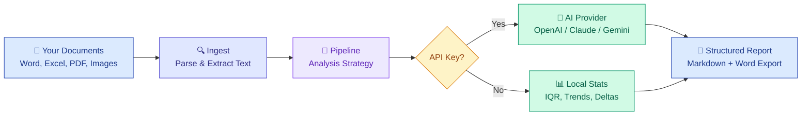
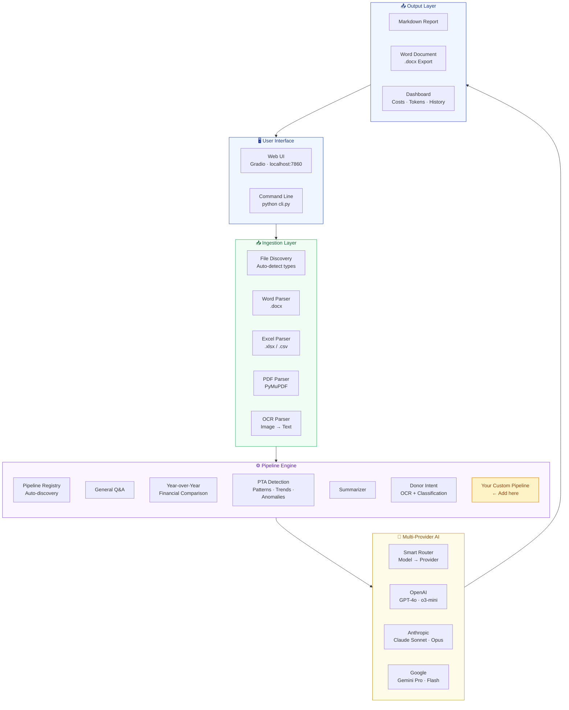
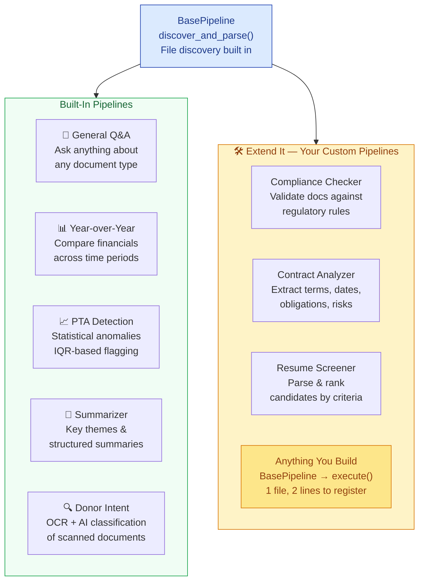
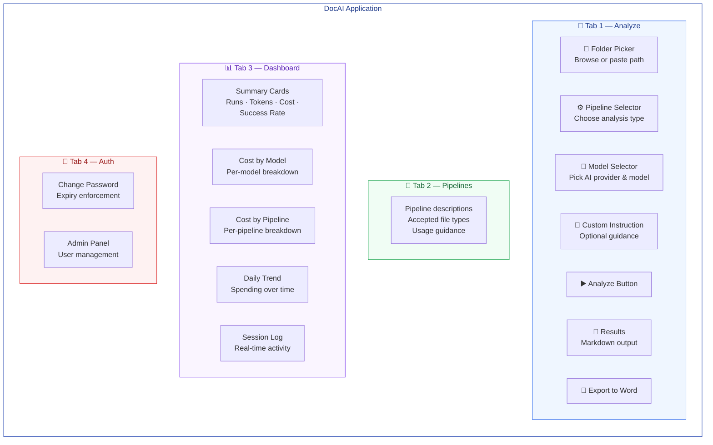
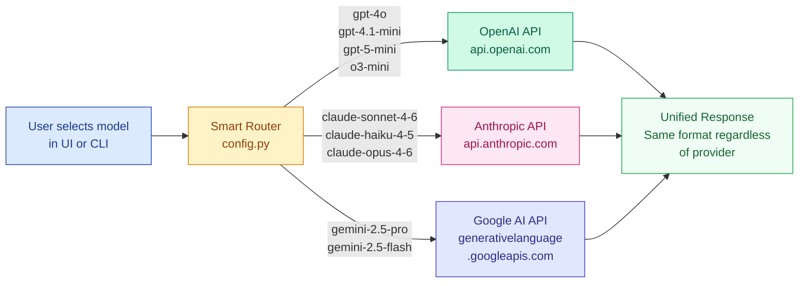

# DocAI — Your Personal AI-Powered Document Analyst

**Turn hours of manual document review into seconds of automated intelligence.**

DocAI is your personal AI assistant that transforms folders of documents — Word files, spreadsheets, PDFs, and images — into structured analysis, summaries, and actionable insights. Point it at a folder, select a pipeline, and let AI do the heavy lifting.

Supports **OpenAI**, **Anthropic (Claude)**, and **Google (Gemini)** — choose any provider, switch models freely.

## How It Works



> **Your files never leave your machine.** Only the extracted text is sent to the AI provider you choose. Results come back as clean Markdown and downloadable Word reports.

---

## System Architecture



---

## The Power of Pipelines

DocAI's pipeline architecture is its core strength. Each pipeline is a **self-contained analysis strategy** — it knows what file types to accept, how to process them, and what output to produce. The system ships with 5 pipelines, but you can add unlimited custom pipelines with just one file and two lines of registration.



**Every pipeline gets for free:**
- Automatic file discovery and type filtering
- Document parsing (Word, Excel, CSV, PDF, images)
- Smart chunking for large document sets
- LLM integration with any provider
- Cost tracking and error logging
- Web UI dropdown + CLI `--pipeline` flag

---

## Application Overview



---

## Multi-Provider AI Routing

DocAI automatically sends your request to the right provider based on the model you select. No manual configuration — just pick a model and go.



---

## Features

- **Multi-Provider AI** — Use GPT-4o, Claude Sonnet, Gemini Pro, or any supported model
- **5 Analysis Pipelines** — Financial comparison, pattern detection, summarization, donor intent OCR, and universal Q&A
- **Local-First** — Your documents stay on your machine; only extracted text is sent to the AI provider
- **Web UI + CLI** — Beautiful Gradio interface or command-line for automation
- **Word Export** — Download structured reports as `.docx` files
- **Cost Tracking** — Built-in token counting and cost estimation dashboard
- **Extensible** — Add custom pipelines in minutes

## Quick Start

```bash
# 1. Clone the repo
git clone https://github.com/YOUR_USERNAME/DocAI-Public.git
cd DocAI-Public

# 2. Create virtual environment
python -m venv venv
venv\Scripts\activate        # Windows
# source venv/bin/activate   # Linux / Mac

# 3. Install dependencies
pip install -r requirements.txt

# 4. Configure your API key (at least one provider)
cp .env.example .env
# Edit .env and add your API key(s)

# 5. (Optional) Generate sample test data
python create_test_data.py

# 6. Launch
python app.py
# Opens at http://127.0.0.1:7860
```

## Supported Models

| Provider | Models | API Key Env Var |
|----------|--------|-----------------|
| **OpenAI** | `gpt-4o`, `gpt-4.1-mini`, `gpt-5-mini`, `o3-mini` | `OPENAI_API_KEY` |
| **Anthropic** | `claude-sonnet-4-6`, `claude-haiku-4-5`, `claude-opus-4-6` | `ANTHROPIC_API_KEY` |
| **Google** | `gemini-2.5-pro`, `gemini-2.5-flash` | `GOOGLE_API_KEY` |

Set at least one provider's API key in your `.env` file. DocAI automatically routes requests to the correct provider based on the model you select.

## Pipelines

| Pipeline | Key | What It Does | File Types |
|----------|-----|-------------|------------|
| **General Q&A** | `general` | Upload any docs, ask any question — universal assistant | all types |
| **Year-over-Year** | `year_over_year` | Compare financials across Excel/Word files with change tables | xlsx, csv, docx |
| **PTA Detection** | `pta` | Find patterns, trends, and anomalies using IQR statistics | xlsx, csv, docx, pdf |
| **Summarizer** | `summarizer` | Structured summaries with key themes from document sets | docx, pdf, csv, xlsx |
| **Donor Intent** | `donor_intent` | AI vision OCR on scanned images, extract donor intent + classify | image, pdf, docx |

All pipelines work **with or without** an API key:
- **With API key**: Full LLM analysis + local statistical output
- **Without API key**: Local statistical analysis only (no LLM)

## CLI Usage

```bash
# Run a specific pipeline
python cli.py ./test_data/financials --pipeline year_over_year
python cli.py ./test_data/reports --pipeline summarizer
python cli.py ./test_data/financials --pipeline pta
python cli.py ./folder_of_scans --pipeline donor_intent

# With custom instruction
python cli.py ./data --pipeline pta "Focus on travel expense anomalies"

# Save output
python cli.py ./data --pipeline year_over_year --output report.md

# List available pipelines
python cli.py --list-pipelines
```

## Web UI

```bash
python app.py
```

The Gradio interface has tabs for:
1. **Analyze** — Folder picker, pipeline selector, model chooser, results
2. **Pipelines** — Description of each pipeline and accepted file types
3. **Dashboard** — Processing log, cost tracking, and session activity

## How to Add a New Pipeline

1. **Create a new file** in `pipelines/`:

```python
# pipelines/my_pipeline.py
from pathlib import Path
from ingest.discovery import FileType
from pipelines.base import BasePipeline, PipelineResult

class MyPipeline(BasePipeline):
    name = "my_pipeline"
    description = "What this pipeline does"
    accepted_types = [FileType.DOCX, FileType.PDF]

    def execute(self, folder_path: str, instruction: str = "", model: str | None = None) -> PipelineResult:
        folder = Path(folder_path)
        parsed, errors = self.discover_and_parse(folder)

        if not parsed:
            return PipelineResult(
                pipeline_name=self.name, success=False,
                output="No files found.", errors=errors,
            )

        # Your analysis logic here
        return PipelineResult(
            pipeline_name=self.name,
            success=True,
            output="# My Analysis\n\nResults here...",
            files_processed=len(parsed),
            errors=errors,
        )
```

2. **Register it** in `pipelines/__init__.py`:

```python
from pipelines.my_pipeline import MyPipeline

PIPELINES["my_pipeline"] = MyPipeline
PIPELINE_LABELS["my_pipeline"] = "My Custom Pipeline"
```

3. **That's it** — the pipeline automatically appears in the UI and CLI.

## Architecture

```
DocAI-Public/
├── app.py                  # Gradio web UI
├── cli.py                  # Command-line interface
├── config.py               # Multi-provider settings
├── create_test_data.py     # Generate sample test files
├── pipelines/              # Pipeline modules
│   ├── __init__.py         # Registry
│   ├── base.py             # BasePipeline class + PipelineResult
│   ├── year_over_year.py   # Financial comparison
│   ├── pta.py              # Pattern/Trend/Anomaly detection
│   ├── summarizer.py       # Document summarization
│   ├── donor_intent.py     # OCR + intent extraction
│   └── general.py          # Universal Q&A
├── ingest/                 # File parsers
│   ├── discovery.py        # File type detection
│   ├── docx_parser.py      # Word documents
│   ├── xlsx_parser.py      # Excel spreadsheets
│   ├── csv_parser.py       # CSV files
│   ├── pdf_parser.py       # PDF documents
│   └── ocr_parser.py       # Image OCR (Gemini vision)
├── analyze/                # LLM analysis
│   ├── client.py           # Multi-provider LLM client
│   ├── prompts.py          # Prompt templates
│   └── strategies.py       # Single-shot vs map-reduce
├── present/                # Output formatting
│   ├── formatter.py        # Markdown/JSON output
│   ├── word_export.py      # .docx report generation
│   └── visualizer.py       # Plotly charts
└── test_data/              # Generated sample files
```

## Dependencies

- **python-docx** — Word document parsing/writing
- **openpyxl** — Excel spreadsheet parsing
- **pandas** — Data manipulation and statistics
- **PyMuPDF** — PDF text extraction
- **gradio** — Web UI
- **openai** — Multi-provider LLM client (OpenAI-compatible API)
- **tiktoken** — Token counting

## Security

- Your documents never leave your machine — only extracted text is sent to the AI provider you choose
- API keys stored in `.env` (gitignored — never committed)
- Gradio binds to `127.0.0.1` only (not network-accessible by default)

## License

[MIT](LICENSE) — Created by [Haidar Hadi](https://github.com/hhadi)

---

## PAI Status

- **Stage:** launched
- **Status:** shipped
- **Score:** 2.15 (R:1 S:3 U:2 M:1)
- **Blocking:** None
- **Next action:** Post LinkedIn announcement. Monitor GitHub for issues/stars.
- **How to start:** `cd /mnt/c/GitHub/DocAI-Public && python app.py`
- **Last updated:** 2026-03-17
